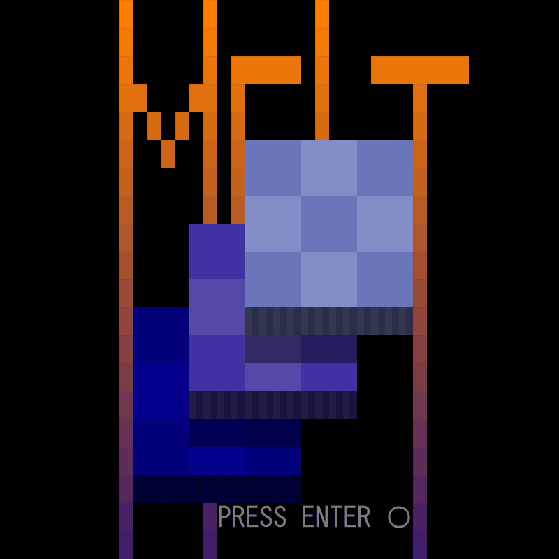
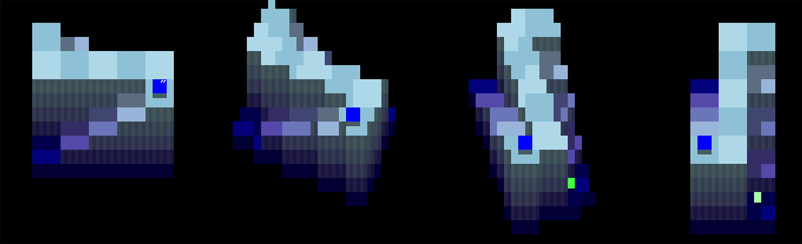

# hew-console-game

本プロジェクトは、進級制作展（HAL EVENT WEEK）に向けて個人で開発したゲームです。

**80×25**のWindowsコンソールをインターフェースとし、**C言語**で実装しています。




## 開発環境

Visual Studio 2022


## 機能

### 視点の回転

<p float="left">


</p>


## 実装方法について

### ダブルバッファ

##### データ構造

```c++
struct Pixel {
    Color color_fore; // 前景色
    Color color_back; // 背景色
    wchar_t text;     // 文字
    bool fullwidth;   // 全角文字か
};
```

＊fullwidthがtrueの場合、次のピクセルを出力しないことで、全角文字を表示する

##### 描画

前フレームのバッファと比べ、変わったピクセルだけを出力する


#### Console Screen Buffer

コンソールの出力が遅いため、出力の途中過程が見られることがよくある

そこでScreen Bufferを使って、画面全体を切り替える

以下の関数を

初期化

`CreateConsoleScreenBuffer`　

`enableVirtualTerminalProcessing`


描画

`wsprintf`

`WriteConsole`

`SetConsoleActiveScreenBuffer`


