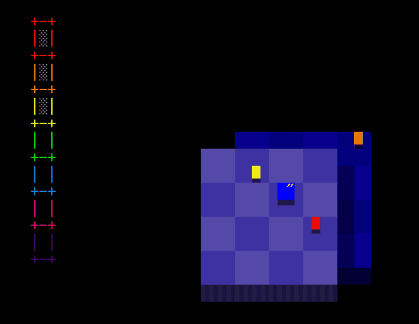

# README

## 概要

進級制作展（HAL EVENT WEEK）に向けて開発した3Dパズルゲーム

### 進級制作展のルール
* 個人製作
* C言語で開発、外部ライブラリを使わない
* 80×25文字のWindowsコンソールで画面表示

## 特徴

### アイテム収集
アイテムを全部集めてステージクリア
* ステージの変化と共に、アイテムが現れる
* 「順番で集める」 ・ 「時間制限内に見つける」　をチャレンジしよう！
* だんだん難しくなる３つのステージがある

### 視点回転
回転して固定視点では見えないアイテムを見つける

### 立体感の演出

#### 影
ステージ、プレーヤー、アイテムの影を表示する

#### シルエット表示
プレーヤーが物陰に隠れた時にシルエットを表示する

