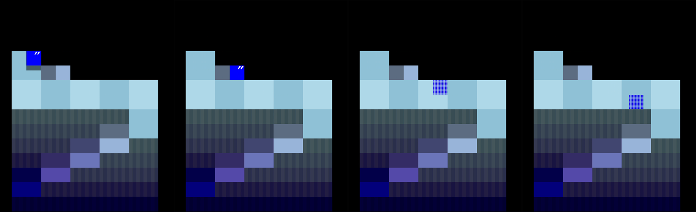

# README

## 概要

進級制作展（HAL EVENT WEEK）に向けて開発した3Dパズルゲーム

### 進級制作展のルール
* 個人製作
* C言語で開発、外部ライブラリを使わない
* 80×25文字のWindowsコンソールで画面表示

### このゲーム
「MELT」 ーー 溶け続ける世界で宝物を集めよう！

プレイ動画

https://github.com/user-attachments/assets/731b03d6-a6fe-464b-ae1a-1223e3912e0e

## 特徴

### アイテム収集
アイテムを全部集めてステージクリア
* ステージの変化と共に、アイテムが現れる
* 「順番で集める」 ・ 「時間制限内に見つける」　をチャレンジ
* だんだん難しくなる３つのステージがある

### 視点回転
回転して固定視点では見えないアイテムを見つける

### 立体感の演出

影 ーー ステージ、プレーヤー、アイテムの影を表示する

シルエット表示 ーー プレーヤーが物陰に隠れた時にシルエットを表示する

