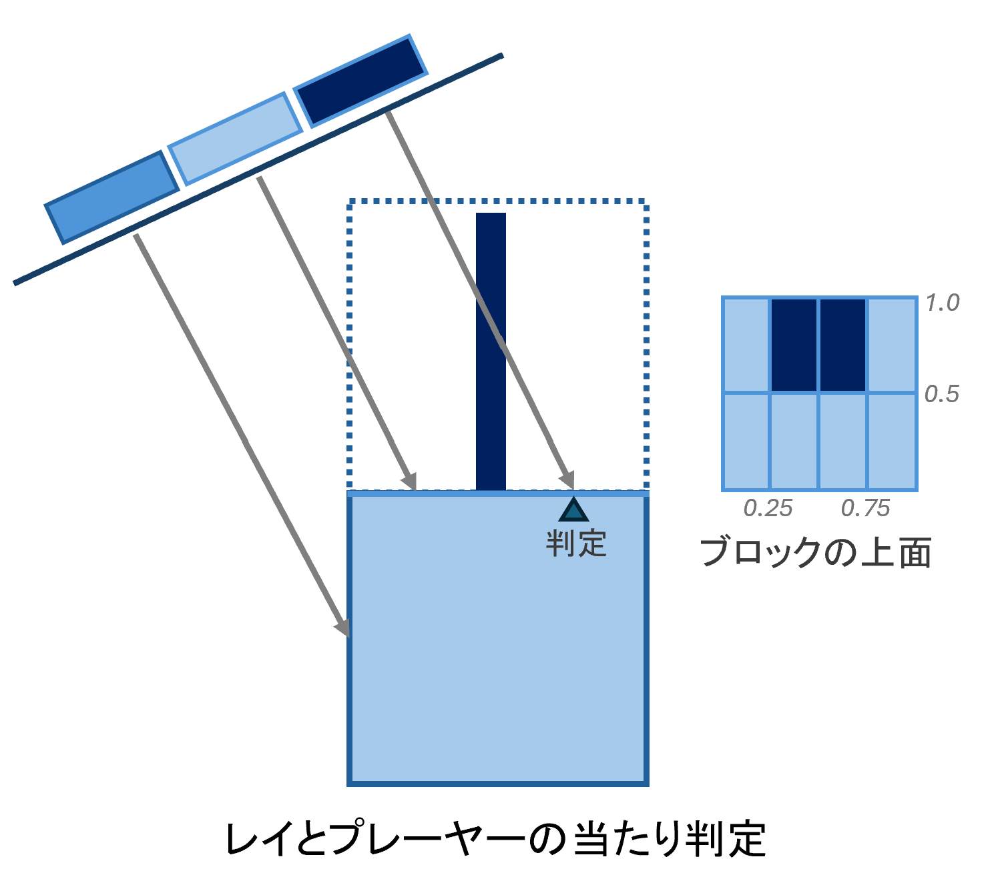

# README

## 概要

進級制作展（HAL EVENT WEEK）に向けて開発した3Dパズルゲーム

### 進級制作展のルール
* 個人製作
* C言語で開発、外部ライブラリを使わない
* 80×25文字のWindowsコンソールで画面表示

### このゲーム
「MELT」 ーー 溶け続ける世界で宝物を集めよう！

プレイ動画

https://github.com/user-attachments/assets/731b03d6-a6fe-464b-ae1a-1223e3912e0e

## 特徴

### アイテム収集
アイテムを全部集めてステージクリア
* ステージの変化と共に、アイテムが現れる
* 「順番で集める」 ・ 「時間制限内に見つける」　をチャレンジ
* だんだん難しくなる３つのステージがある

<p>


</p>

### 視点回転
回転して固定視点では見えないアイテムを見つける
<p>


</p>

### 立体感の演出

影 ーー ステージ、プレーヤー、アイテムの影を表示する
<p>


</p>

シルエット表示 ーー プレーヤーが物陰に隠れた時にシルエットを表示する
<p>


</p>

## 実装方法について

### 1-マップ表示
80×25文字（ピクセル）、フォントはMS ゴシック（幅：高さ＝1：2）というルールの中に3D空間を表現するため  
1×1×1サイズのブロックで構成されたマップを正投影で描画

正面から見ると：
* 上面：4×2 ピクセル
* 側面：4×1 ピクセル

<p>


</p>

#### 正面視点の座標変換
任意の3D座標をスクリーン上のピクセル位置へ変換:

```c++
// 前方向の場合
screen.x = world.x * 4; // 4: ブロックの幅
screen.y = -world.z * 2 - world.y * 1; // 2: ブロックの深さ 1: ブロックの高さ
```

プレイヤーやアイテムもこのようにワールド座標からスクリーン座標へ変換できる  

前後左右4方向の正面視点それぞれに対応するスクリーン座標変換がある  
スクリーンに対する右方向、前方向を使って

* 入力からプレイヤー移動量への変換
* プレーヤー視点における前後左右のブロックの取得（影の計算用）

#### ファイル構造

* world.h ---- マップのデータを配列に保存する 

  移動や当たり判定は3Dのワールド座標上で計算され、表示方法と独立している

* world_view.h ---- マップの描画

  * world_view_top.h ---- 正面視点の描画、計算が簡単
  * world_view_raycast.h ---- 回転視点（マップ回転中）の描画、レイキャスティングで描画

* cube.h ---- ブロックの色や柄の定義

  * cube_top.h ---- 正面視点の一個のブロックを描画


### 2-レイキャスティング

#### アルゴリズム
回転している場合、ピクセルごとにレイを発射し、ブロックとの交点でそのピクセル文字や色を決める

A Fast Voxel Traversal Algorithm for Ray Tracing (Amanatides, John & Woo, Andrew、1987) に基づき、レイとブロックの交点を計算する  
この記事を参考にした：[An Overview of the Fast Voxel Traversal Algorithm](https://github.com/cgyurgyik/fast-voxel-traversal-algorithm/blob/master/overview/FastVoxelTraversalOverview.md)

#### レイの生成
##### 方向
正面視点と一致するため、レイは水平面と角度$\theta$（$\tan\theta=2$）となす 
<p>

</p>
前方向の場合：

 * レイの方向：$(0, -\frac{2\sqrt{5}}{5}, \frac{\sqrt{5}}{5})$
 

マップの回転はレイを逆方向に回転させて実現する  

##### 始点
スクリーン中心を視点中心からレイの逆方向を沿って移動  
スクリーンの横、縦方向をワールド座標に変換し、一個のピクセルの大きさを調整すると、正面視点と一致になる  
前方向の場合：
* スクリーン横方向：$(0.25, 0, 0)$
* スクリーン縦方向：$(0, -0.2, -0.4)$

#### オブジェクト表示
レイとオブジェクト（プレーヤーやアイテム）の当たり判定は、レイとブロック表面との交点座標から近似する
* レイ経過しているブロックにオブジェクトが存在かを判定
* 存在する場合、次の交点座標を計算し、ブロック表面における相対的な位置を得る
* 相対位置から、当たるかを判定する
<p>

</p>